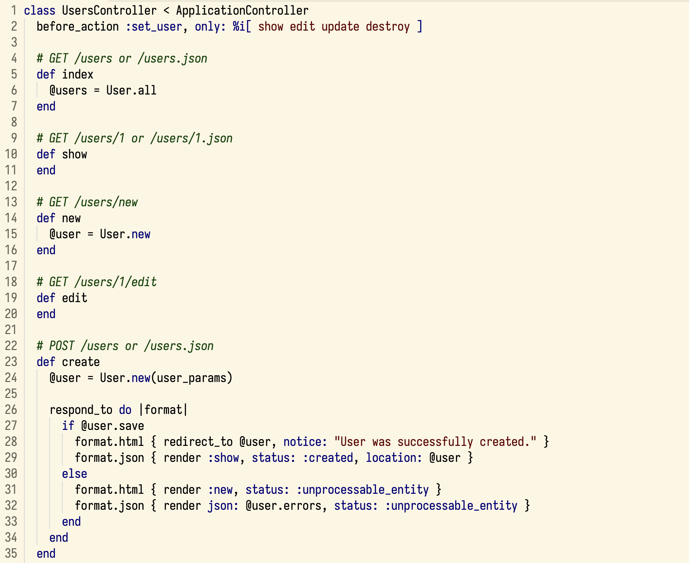

# Solarized Crisp

Solarized Crisp is a **high-contrast, minimalistic Solarized light theme** for Visual Studio Code, designed for clarity, crisp typography, and reduced visual noise.

## Features

- Higher contrast compared to classic Solarized
- Minimalistic syntax highlighting
- Optimized for long coding sessions
- Clean UI with reduced color clutter

## Installation

1. Open **Extensions** in VS Code
2. Search for **Solarized Crisp**
3. Install and select the theme via
   `Preferences → Color Theme`
